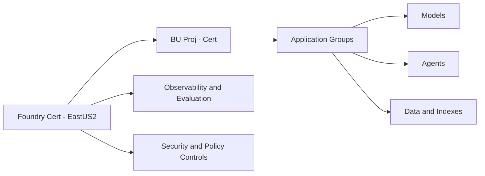

# Cert Topology

Cert is intentionally aligned 1:1 with Prod in structure and controls.

Source: [diagrams/cert-topology.mmd](diagrams/cert-topology.mmd)

## Environment Configuration

### Agent Support

Reference: [agentmd](agentmd.md)

### Trouble shooting

Reference: [Troubles](README-TROUBLESHOOTING.md)

