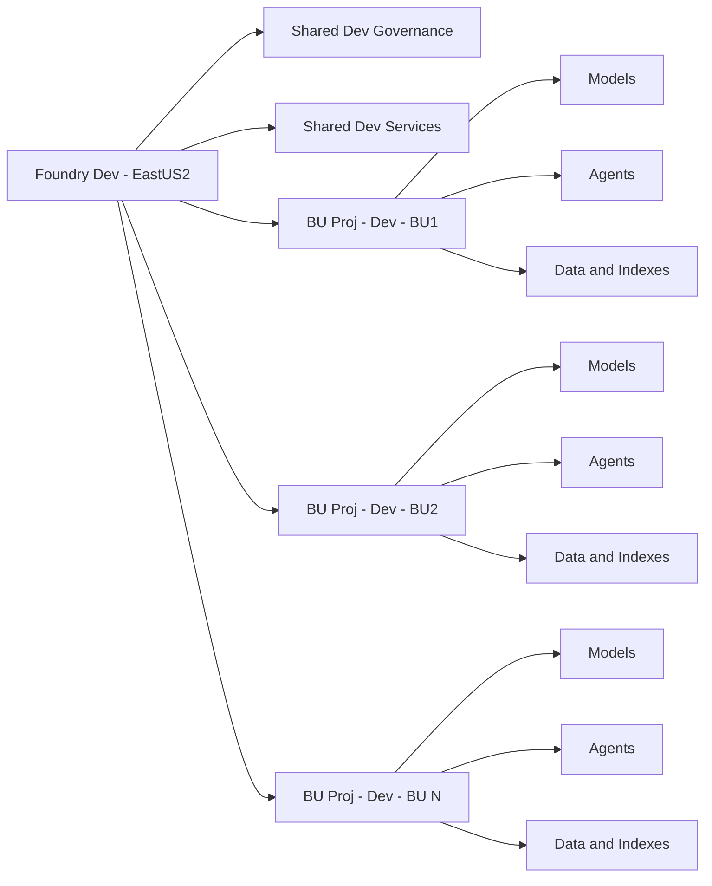

# Dev Topology

Supporting all Business Units in Dev from a single shared Dev platform in EastUS2.

Source: [diagrams/dev-topology.mmd](diagrams/dev-topology.mmd)

## Environment Configuration

### Agent Support

Reference: [agentmd](agentmd.md)

### Trouble shooting

Reference: [Troubles](README-TROUBLESHOOTING.md)

