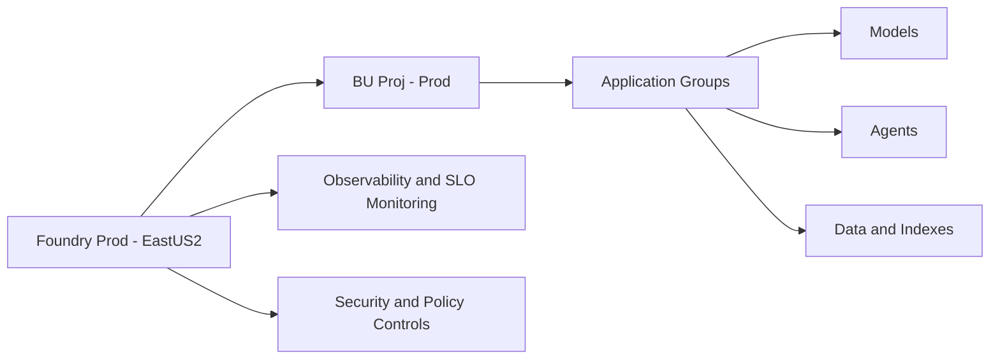

# Prod Topology

Prod mirrors Cert by design (same structure and control model).

Source: [diagrams/prod-topology.mmd](diagrams/prod-topology.mmd)

## Environment Configuration

### Agent Support

Reference: [agentmd](agentmd.md)

### Trouble shooting

Reference: [Troubles](README-TROUBLESHOOTING.md)

