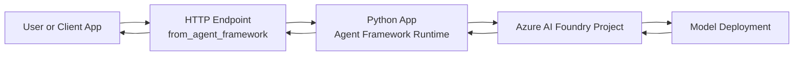
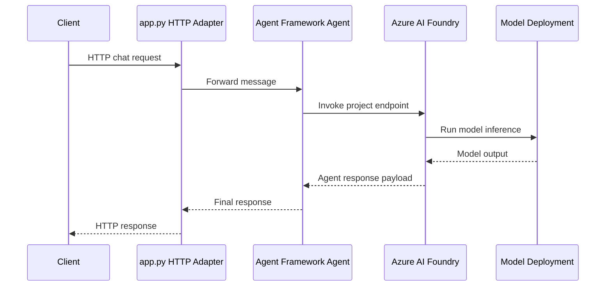

# Hello World Chat Engine (Python Agent Framework)

This is a minimal Microsoft Agent Framework chat engine using Python and Azure AI Foundry.

For operational issues and region limitations, see [README-TROUBLESHOOTING.md](KB/README-TROUBLESHOOTING.md).

## What is included

- HTTP-hosted agent entry point (`Model Manager/app.py`)
- Pinned SDK versions for preview compatibility (`Model Manager/requirements.txt`)
- Environment variable template (`Model Manager/.env.example`)

## Where Agent Framework Fits

Agent Framework is the orchestration/runtime layer in your app process.

- Azure AI Foundry provides the project endpoint and model deployment.
- Agent Framework creates and runs the agent using those Foundry resources.
- The hosting adapter exposes the agent over HTTP so apps or tools can call it.



## Prerequisites

- Python 3.10+
- Azure sign-in (`az login`) or another supported credential flow
- Azure AI Foundry project + model deployment

## Project Setup and configuration

- Project access and role assignment guidance: [Project-Auth.md](KB/Project-Auth.md)
- Shared versus dedicated model strategy: [Model Deployment Strategy.md](KB/Model%20Deployment%20Strategy.md)

## Creating foundry Resource

When you create a Foundry resource, Azure asks for both:

- Resource Group
- Region (Location)

These are related but not the same thing.

### Resource Group region

The resource group region stores metadata for the resource group.
It does not force every resource inside that group to be created in the same region.

### Foundry resource region

This is where the Foundry service actually runs.
It affects:

- Feature and model availability
- Agent capability availability
- Latency and data residency behavior
- Regional quotas and capacity

### Why Azure asks for region again

Foundry is a regional service. Azure needs the exact deployment region for service capacity and feature support.

Example:

- Resource Group: East US
- Foundry resource: East US 2

This is valid.

### Practical guidance

1. Pick region based on Foundry feature/model availability first.
2. Then optimize for latency/compliance needs.
3. Keep resource group and resource in the same region only when it also meets feature requirements.

## Foundry Networking and Identity (Portal Guide)

When you create Azure AI Foundry resources in Azure, you typically configure these in the same setup flow:

- Networking access mode (All networks vs Selected networks)
- Private endpoint (optional, recommended for enterprise)
- Managed identity (system-assigned or user-assigned)

### What "Selected networks" Means

"Selected networks" means your Foundry resource is not open to all public sources.
Only traffic from explicitly allowed network paths is accepted.

In practice, this usually means one of these patterns:

1. Allow specific VNET/subnet rules (public endpoint with firewall rules).
2. Use Private Endpoint and route traffic privately over Azure networking.

### Why You Are Asked for VNET and Subnet

Azure needs to know exactly where trusted traffic originates.

- VNET defines the private network boundary.
- Subnet defines the exact segment where access is allowed or where the private endpoint NIC is placed.

### If Your App Is in Another VNET or Another Subscription

Yes, VNETs belong to subscriptions, but cross-subscription connectivity is supported.
You can still connect to Foundry across VNETs/subscriptions if networking and DNS are set correctly.

Common approaches:

1. Private Endpoint in the workload VNET

- Create/approve a Private Endpoint for the Foundry resource in the VNET where your app runs (even if that VNET is in another subscription, with proper permissions).
- Configure private DNS so the Foundry endpoint resolves to the private IP.

2. Peered VNETs to a central Private Endpoint

- Host Private Endpoint in a hub VNET and connect spoke VNETs using peering.
- Ensure NSG/UDR rules allow traffic and private DNS zones are linked to all consuming VNETs.

3. Public endpoint with Selected networks (less private)

- Keep public endpoint enabled but restrict allowed VNET/subnet rules.
- Useful for simpler setups, but less strict than Private Endpoint-only designs.

### Managed Identity in This Setup

Managed identity is for identity/authz, not network path.

- Networking controls "can it reach the endpoint?"
- Managed identity controls "is it authorized after reaching it?"

For production, use both:

1. Private networking (Selected networks + Private Endpoint).
2. Managed identity + least-privilege RBAC on Foundry resources.

### Quick Rule of Thumb

- If you want strongest isolation: disable public access and use Private Endpoint.
- If consumers are in multiple VNETs/subscriptions: plan DNS + peering (or multiple private endpoints) up front.
- If you are unsure, start with one workload VNET and one private endpoint, validate, then scale the topology.

## Setup

1. Create and activate a virtual environment.
2. Install dependencies:

```bash
pip install -r requirements.txt
```

3. Create `Model Manager/.env` from `Model Manager/.env.example` and set values:

- `FOUNDRY_PROJECT_ENDPOINT`
- `FOUNDRY_MODEL_DEPLOYMENT_NAME`

## Run

```bash
python Model Manager/app.py
```

When started successfully, the service runs using the Agent Framework hosting adapter.

## Tiny HTTP Test Example

After starting the service, send a simple request to confirm the hello-world flow.

PowerShell example:

```powershell
$body = @{
	input = "Hi there"
	stream = $false
} | ConvertTo-Json -Depth 5

Invoke-RestMethod \
	-Method POST \
	-Uri "http://localhost:8088/runs" \
	-ContentType "application/json" \
	-Body $body
```

curl example:

```bash
curl -X POST "http://localhost:8088/runs" \
	-H "Content-Type: application/json" \
	-d "{\"input\":\"Hi there\",\"stream\":false}"
```

Expected behavior:

1. The first response should include a greeting such as Hello, world!.
2. Responses should remain concise and friendly.

## Request Flow

The runtime flow for a single chat request looks like this:



## Startup Flow

At startup, `app.py` does the following:

1. Loads environment variables (`load_dotenv(override=False)`).
2. Validates `FOUNDRY_PROJECT_ENDPOINT` and `FOUNDRY_MODEL_DEPLOYMENT_NAME`.
3. Creates `DefaultAzureCredential` for auth.
4. Creates `AzureAIClient` and agent via `as_agent(...)`.
5. Runs the HTTP server adapter with `from_agent_framework(agent).run_async()`.

## Notes

- `load_dotenv(override=False)` is used so hosted/runtime env vars take precedence over local `.env`.
- SDKs are pinned because preview versions can have breaking API changes.

## AIDS Foundry Portal (React + FastAPI)

This repo now includes a simple developer portal wrapper over Foundry discovery.

- Backend: `src/Agent Manager` (FastAPI)
- Frontend: `src/Portal UI` (React + Vite)

### Separation of concerns

1. API routes and request handling are in `src/Agent Manager/api.py`.
2. Foundry discovery logic is isolated in `src/Agent Manager/foundry_inventory.py`.
3. Portal DTO contracts are isolated in `src/Agent Manager/portal_models.py`.
4. UI rendering and interaction are in `src/Portal UI/src/App.jsx`.

### Portal sections

- `AIDS Agents` from `/v1/portal/agents`
- `AIDS Models` from `/v1/portal/models`

### Multi-Foundry configuration

The portal supports one or many Foundry projects.

- Copy `src/Agent Manager/.env.example` to `src/Agent Manager/.env`
- Set either:
	- `FOUNDRY_PROJECT_ENDPOINT` for a single Foundry (fallback mode), or
	- `FOUNDRY_PORTAL_PROJECTS` JSON array for multi-Foundry mode

Example:

```env
FOUNDRY_PORTAL_PROJECTS=[{"name":"Foundry-Dev","endpoint":"https://your-dev.services.ai.azure.com/api/projects/dev"},{"name":"Foundry-Test","endpoint":"https://your-test.services.ai.azure.com/api/projects/test"},{"name":"Foundry-Prod","endpoint":"https://your-prod.services.ai.azure.com/api/projects/prod"}]
```

### Run backend

```bash
cd src/Agent\ Manager
python app.py
```

Backend runs on `http://127.0.0.1:8010`.

### Run React UI

```bash
cd src/Portal\ UI
npm install
npm run dev
```

UI runs on `http://127.0.0.1:5173` and proxies `/v1/*` to the backend.
